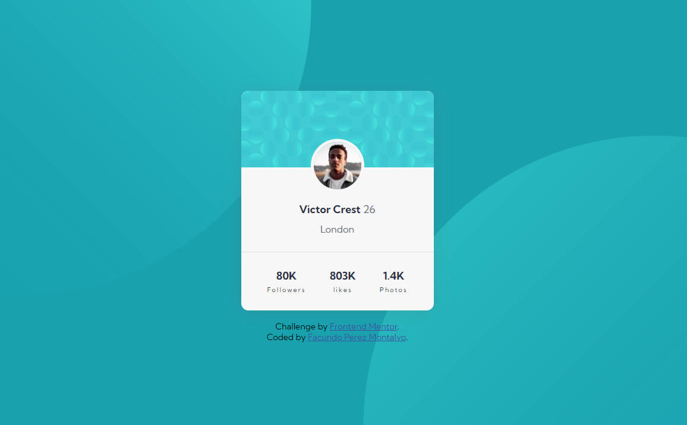

## Profile Card Component

Users should be able to:

- View the optimal layout for the app depending on their device's screen size
- See hover states for all interactive elements on the page
- Generate a new piece of advice by clicking the dice icon

## Screenshot

## Links

- Live site deployed on Vercel: [Deploy](https://profile-card-facundo.vercel.app/)

## Built with

- HTML5
- CSS
- Flexbox

## What I learned

I am still learning how to position components using Flexbox, and how position absolute will attach images to certain places of the parent component plus I am learning the importance of accessibility on web development projects.

### Continued development

In this project my goal was to keep learning my HTML and CSS skills, I'm learning on positioning images with position absolute and relative.

### Useful resources

- [CSS Tricks](https://css-tricks.com/)

## Author

- Github Profile - [https://github.com/facuperezm](https://github.com/facuperezm)
- FrontendMentor - [https://www.frontendmentor.io/facuperezm](https://www.frontendmentor.io/profile/facuperezm)
- Twitter - [https://twitter.com/FacuPerezM](https://twitter.com/FacuPerezM)
